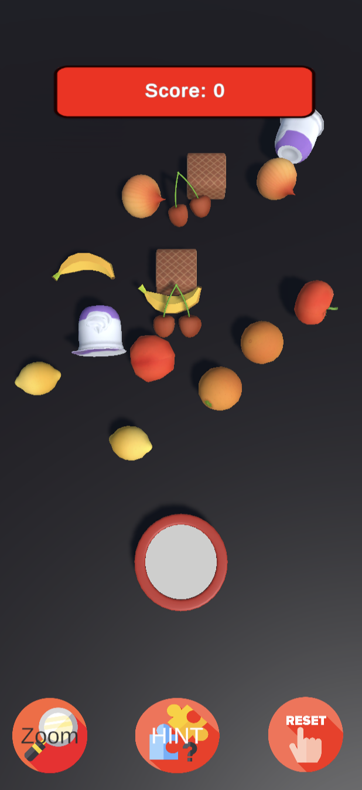
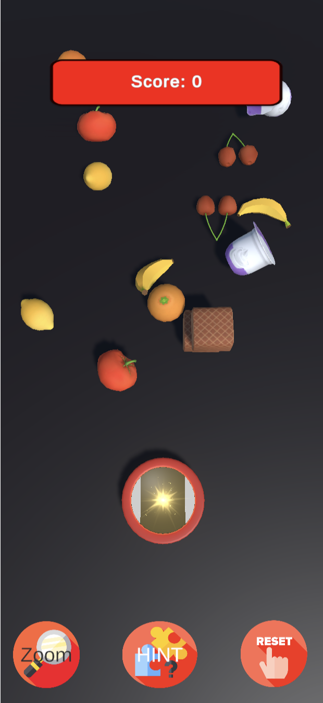
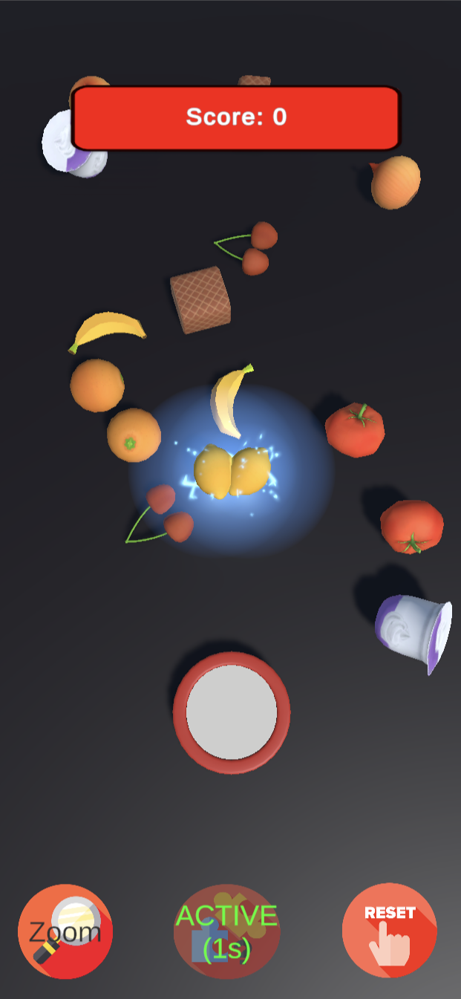
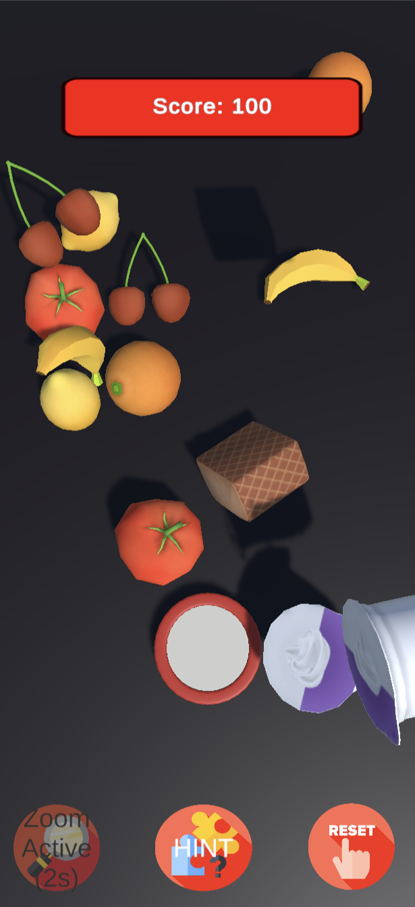

# Meyve Eşleştirme Oyunu 🍎🍊🍇  

**İzmir Bakırçay Üniversitesi**  
**Öğrenci No:** 210601010  
**Geliştirici:** Melisa Erdem  

## Oyun Hakkında 🎮  
Meyve Eşleştirme Oyunu, oyuncuların çeşitli meyveleri eşleştirerek puan kazandığı eğlenceli ve bağımlılık yapan bir oyundur. Sezgisel tasarımı ve kullanıcı dostu arayüzüyle her yaştan oyuncuya hitap eder.  

## Özellikler 🌟  
- **Doğru Yerleştirme**: Nesneler doğru şekilde eşleştirildiğinde oyuncular puan kazanır.  
- **Yanlış Yerleştirme**: Hatalı eşleşmelerde puan kazanılmaz.  
- **Yetenek Butonları**:  
  - **Zoom Butonu**: Oyuncular, simgeleri büyüterek daha rahat oynayabilir.  
  - **İpucu Butonu**: Oyuncular sıkıştıklarında yardım alabilir.  
  - **Reset Butonu**: Oyuncular oyunu sıfırlayabilir.  
  - **Cooldown Mekaniği**: Butonların tekrar kullanılabilir hale gelmesi için belirli bir bekleme süresi uygulanır.  

## WebGL Yayını 🌐  
Oyun, **Unity Play** üzerinden WebGL olarak yayınlanmıştır. Oyunu tarayıcınız üzerinden oynamak için aşağıdaki bağlantıyı kullanabilirsiniz:  
[Oyun Bağlantısı](#)  
_(Lütfen bağlantıyı yayınlandıktan sonra güncelleyiniz.)_  

  
  
  
  

## Teknoloji ve Araçlar 🛠️  
- **Oyun Motoru**: Unity  
- **Programlama Dili**: C#  
- **Grafik Tasarım**: Unity Asset Store veya özel tasarımlar  
- **Platform**: Windows, MacOS, Android  

## Kullanım 🚀  
1. Oyunu başlatın.  
2. Aynı türdeki meyveleri eşleştirerek puan kazanın.  
3. **Zoom**, **İpucu** ve **Reset** butonlarını stratejik şekilde kullanın.  
4. En yüksek puanı hedefleyin!  

## Kurulum ve Çalıştırma 💻  
1. Unity yüklü bir bilgisayara sahip olun.  
2. Proje dosyalarını Unity üzerinde açın.  
3. `Build Settings` menüsünden WebQL seçerek oyunu derleyin.  
4. Çıktı dosyasını çalıştırarak oyunu oynayın.  
